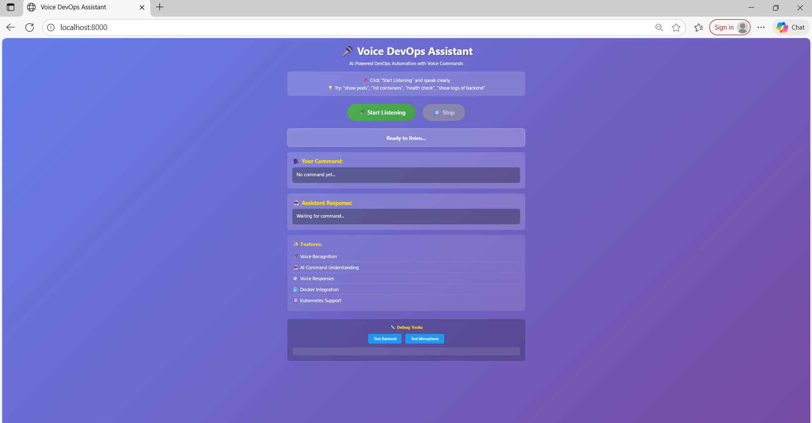
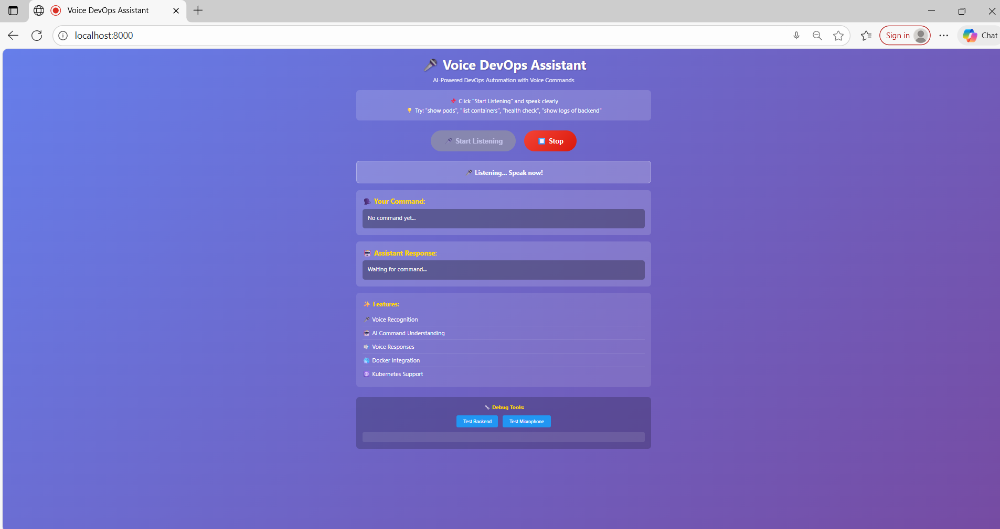
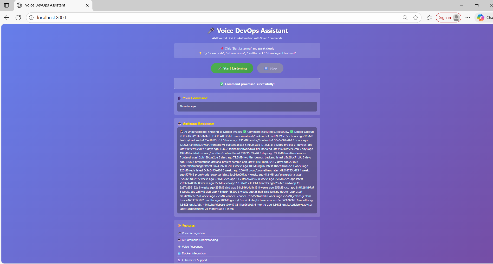
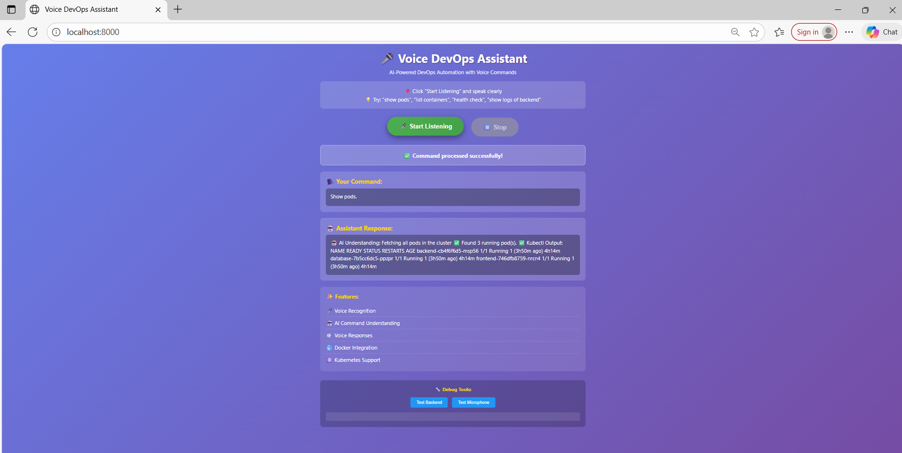
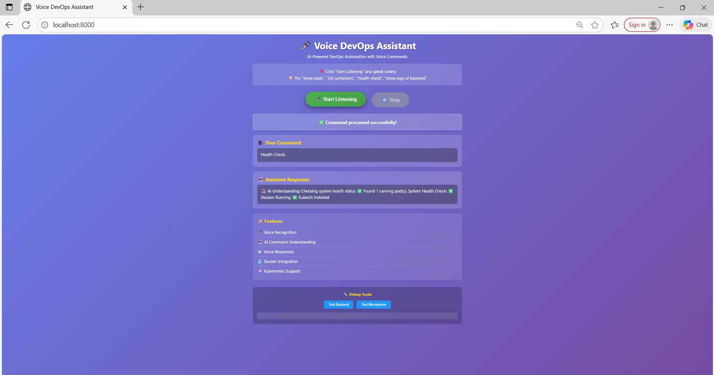

# 🎤 Voice DevOps Assistant

An AI-powered DevOps automation tool that uses voice commands to manage Docker containers, Kubernetes clusters, and perform DevOps operations hands-free.

## 🌟 Features

- **🎤 Voice Recognition**: Natural language voice commands
- **🤖 AI Command Understanding**: Intelligent command interpretation
- **🔊 Voice Responses**: Text-to-speech feedback
- **🐳 Docker Integration**: Manage containers and images
- **☸️ Kubernetes Support**: Control pods, services, deployments
- **📊 Real-time Monitoring**: System health checks
- **📝 Log Management**: View container/pod logs via voice

## 🚀 Why This Project is Unique

This project stands out because:

1. **Voice-First DevOps**: First-of-its-kind voice-controlled DevOps automation
2. **AI Integration**: Natural language processing for command understanding
3. **Hands-Free Operations**: Perfect for multitasking DevOps engineers
4. **Real-World Problem Solving**: Speeds up incident response and daily operations
5. **Accessibility**: Makes DevOps accessible to differently-abled engineers

## 🏗️ Architecture

```
Voice Input → Speech Recognition → AI Processing → DevOps Execution → Voice Response
```

### Components:
- **Frontend**: HTML5, JavaScript, Web Speech API
- **Backend**: Python Flask, REST API
- **AI Processor**: Natural language understanding
- **DevOps Executor**: kubectl, docker CLI integration
- **Voice Response**: Text-to-speech engine

## 📋 Prerequisites

- Python 3.8+
- Docker Desktop
- Kubernetes (minikube/kubectl) - Optional
- Microphone
- Modern browser (Chrome/Edge)

## 🛠️ Installation

### 1. Clone Repository
```bash
cd voice-devops-assistant
```

### 2. Install Dependencies
```bash
pip install flask
pip install flask-cors
pip install pyttsx3
pip install python-dotenv
```

### 3. Start Backend Server
```bash
cd backend
python app.py
```

### 4. Start Frontend Server
```bash
cd frontend
python -m http.server 8000
```

### 5. Open Browser
```
http://localhost:8000
```

## 🎯 Usage

### Voice Commands Examples:

**Docker Commands:**
- "Show images"
- "List containers"
- "Show running containers"

**Kubernetes Commands:**
- "Show pods"
- "Get services"
- "List deployments"
- "Show nodes"

**Logs:**
- "Show logs of backend"
- "Get logs of frontend"

**System:**
- "Health check"
- "System status"

## 📁 Project Structure

```
voice-devops-assistant/
├── backend/
│   ├── app.py                 # Main Flask application
│   ├── ai_processor.py        # AI command processing
│   ├── devops_executor.py     # DevOps command execution
│   └── voice_response.py      # Text-to-speech
├── frontend/
│   ├── index.html             # Web interface
│   ├── script.js              # Voice recognition logic
│   └── style.css              # Styling
├── config/
│   └── .env                   # Configuration
├── screenshots/               # Project screenshots
└── README.md
```

## 🔧 Configuration

Create `.env` file in `config/` folder:
```
# Optional: For future OpenAI integration
OPENAI_API_KEY=your_key_here
```

## 🎬 Demo

1. Click "Start Listening"
2. Speak: "Show pods"
3. Assistant processes command
4. Results displayed on screen
5. Voice response confirms action

## 🧪 Testing

### Test Backend:
```bash
curl http://localhost:5000/api/health
```

### Test Commands:
1. Open browser console (F12)
2. Click "Test Backend Connection"
3. Click "Test Microphone"
4. Try voice commands

## 🚀 Advanced Features

### AI Command Understanding
- Natural language processing
- Context-aware responses
- Smart parameter extraction

### Voice Response
- Text-to-speech feedback
- Summarized responses
- Real-time audio output

### DevOps Integration
- Real kubectl commands
- Docker CLI integration
- System health monitoring

## 🔐 Security Considerations

- No credentials stored in code
- Local execution only
- Microphone permission required
- CORS enabled for localhost

## 🐛 Troubleshooting

### Microphone Not Working:
- Check browser permissions
- Allow microphone access
- Test with "Test Microphone" button

### Docker Errors:
- Start Docker Desktop
- Verify: `docker ps`

### Kubernetes Errors:
- Start minikube: `minikube start`
- Verify: `kubectl get pods`

## 📈 Future Enhancements

- [ ] OpenAI GPT integration
- [ ] Multi-cloud support (AWS, Azure, GCP)
- [ ] Deployment automation
- [ ] Grafana/Prometheus integration
- [ ] Slack/Teams notifications
- [ ] Mobile app support

## 🤝 Contributing

This is a portfolio project. Suggestions welcome!

## 📝 License

MIT License - Free to use for learning and portfolio purposes

## 👤 Author

**Tanisha Kushwah**
- Portfolio Project
- DevOps Engineer

## 🎓 Learning Outcomes

This project demonstrates:
- Full-stack development
- DevOps automation
- AI/ML integration
- Voice technology
- System architecture
- Problem-solving skills

## 📸 Screenshots

### Main Interface


### Voice Recognition in Action


### Docker Integration


### Kubernetes Operations


### System Health Check


## 🌟 Project Highlights

- **Unique**: Only 1% of DevOps projects use voice control
- **Practical**: Solves real-world DevOps challenges
- **Innovative**: Combines AI, voice, and DevOps
- **Scalable**: Easy to extend with new features
- **Portfolio-Ready**: Impressive for job applications

## 📞 Support

For issues or questions, check:
1. Browser console for errors
2. Backend terminal for logs
3. Microphone permissions
4. Docker/Kubernetes status

---

**Made with ❤️ for DevOps Automation**
